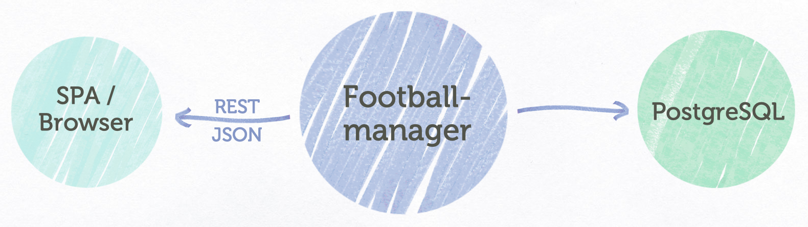

 [](https://kotlinlang.org/)

# Micronaut app using Micronaut Data and GraalVM (written in Kotlin) 
Sample of a simple [Micronaut](https://micronaut.io/) CRUD application using 
[Micronaut Data](https://micronaut-projects.github.io/micronaut-data/latest/guide/) 
and supporting [Oracle's GraalVM/SubstrateVM](https://www.graalvm.org/docs/reference-manual/native-image/).

+ [Scenario](#scenario)
+ [Setup](#setup)
+ [Building and executing the application](#building-and-executing-the-application)
  - [Running on the JVM](#running-on-the-jvm)
  - [Using the native image](#using-the-native-image)
+ [Further hints](#further-hints)
  - [Install GraalVM](#install-graalvm)
  - [Setup PostgreSQL with Docker](#setup-postgresql-with-docker)
  - [Fixing possible errors](#fixing-possible-errors)

### Scenario 
The example contains a _Footballmanager_ microservice which accesses a PostgreSQL and provides the data via REST/JSON.




To create a new _Footballer_ a POST request needs to be submitted to the REST endpoint `http://localhost:8080/footballers`:
```
{
  "firstName": "Toni",
  "lastName": "Kroos",
  "position": "Midfield"
}
```

All existing Footballers can be retrieved be sending a GET request to `http://localhost:8080/footballers`. 

With the optional request parameter `position` all Footballers of a certain position are determined 
(`e.g. http://localhost:8080/footballers?position=Midfield`).

### Setup
The [PostgreSQL](https://www.postgresql.org/) should be running on `jdbc:postgresql://localhost:5432/footballerdb`.
See [below](#setup-postgresql-with-docker) how to setup a dockerized PostgreSQL.

### Building and executing the application

#### Running on the JVM

Building the Fat-/Uber-Jar with Gradle:
```
./gradlew clean shadowJar
```

Executing the JAR via:
```
java -jar build/libs/footballmanager-0.1-all.jar
```

(Or you just start the `Application.kt` in your IDE).


#### Using the native image

How to build a native image of the application with GraalVM/SubstrateVM (installation see [below](#install-graalvm)).

##### Using [GraalVM’s `native-image` tool](https://www.graalvm.org/docs/reference-manual/native-image/):

```
sdk use java 20.3.0.r11-grl

./gradlew clean assemble

native-image --no-server -cp build/libs/footballmanager-0.1-all.jar
```
Executing the native image via: 
```
./footballmanager 
```

##### Using [Micronaut's Gradle Plugin](https://github.com/micronaut-projects/micronaut-gradle-plugin):

Since Micronaut 2.1.0 you can delegate the native image generation to 
[Micronaut's Gradle Plugin](https://github.com/micronaut-projects/micronaut-gradle-plugin):
```
sdk use java 20.3.0.r11-grl

./gradlew nativeImage  

```
Executing the native image via: 
```
./build/native-image/application 
```


### Further hints

#### Install GraalVM 
To manage SDK versions on your local machine [SDKMAN!](https://sdkman.io/jdks#Oracle) is a very helpful tool.
Oracle's GraalVM can be installed with `sdk install java 20.3.0.r11-grl` (or appropriate version).

If you don't want to use [Micronaut's Gradle Plugin](https://github.com/micronaut-projects/micronaut-gradle-plugin) 
you have to install [GraalVM’s `native-image` tool](https://www.graalvm.org/docs/reference-manual/native-image/) 
with the command `gu install native-image`. 

#### Setup PostgreSQL with Docker
Execute the following steps:
```
docker pull postgres  

docker run -p 5432:5432 --name postgres-db -e POSTGRES_PASSWORD=mysecretpassword -d postgres

docker exec -it postgres-db bash
psql -U postgres
CREATE DATABASE footballerdb;
```
#### Fixing possible errors
**Problem:** The first request after starting the app results in an error like this:

```
{
   "message": "Internal Server Error: SQL Error executing Query: ERROR: relation \"footballer\" does not exist\n  Position: 102"
}
```
**Solution:** Please make sure these properties are set in the `application.yaml` so that the table `footballer` is created:

```
datasources:
  default:
    schema-generate: CREATE  # or CREATE_DROP if you want the table to be re-created with each app start
    dialect: postgres
```
